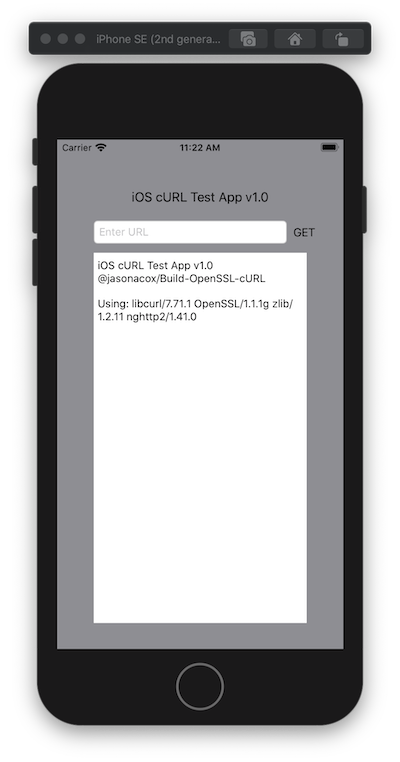

# iOS Test App

This is a test app for iOS using the curl, openssl and nghttp2 libraries.

## Build Instructions

Build the libraries with Mac Catalyst support:

```bash
# For x86-64 Build Nodes
./build.sh -m

# For arm64 (m1) Build nodes
./build.sh
```

Load and build the project using Xcode (tested with version 8.2). Example lib binaries (xcframework)and header files are included but will be replaced when you run the build script.

## Screenshot


